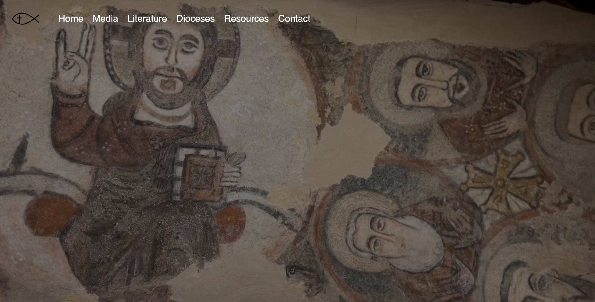

<!-- Dev note: Remember to update link to website -->

## What this project is
Coptic Root is a centralized platform designed to collect and organize online Coptic Orthodox resources. It aims to make key texts, media, and institutional content easily accessible to both Coptic Christians and interested scholars. The project serves as a digital hub for literature, media, diocese directories, magazines, and other relevant resources.

## Why it matters
The Coptic Orthodox Church has a deep and rich heritage, much of which is scattered across various websites, apps, and archives.

Coptic Root makes this wealth of information discoverable and usable through a unified, searchable interface.

It preserves cultural and spiritual heritage while making it more accessible to younger generations and non-Egyptian Copts.

It supports clergy, laypeople, educators, and researchers with a trustworthy source of curated content.

## Screenshots and diagrams
<!-- 
Homepage layout with search and category navigation

Literature section with filters for authors, dates, language

Media page with embedded podcast player and video sermons

Interactive map of dioceses

Mobile vs. desktop UI comparison -->
### 🏠 Home Page

### 📚 Early Church Fathers

### 📖 Synaxar Page

## Links to demos
*Coming soon*
<!-- 
(Include working links here, or mention when a demo will be available)

Live Preview

GitHub Repository

Design Mockups (Figma/Canva) -->

## High-level functionality
*Coming soon*
<!-- Example:
🔍 Powerful search and filtering by type (e.g., hymns, sermons), language, and date

📚 Literature archive with downloadable PDFs and cross-referenced scripture

🗺️ Diocesan directory with interactive map and parish locator

🖼️ Visual gallery of icons and liturgical artwork

📰 Magazine archive with issue viewer and keyword search

🏷️ Tagging and categorization system for discoverability

🌐 Multilingual support (English, Arabic, Coptic) -->

## Who to contact

For inquiries, collaborations, or contributions, contact: 
Antonious Yakoub 
Email: [antyakoub@gmail.com] 
GitHub: [https://github.com/antyakoub] 
LinkedIn: [https://www.linkedin.com/in/antyakoub/] 